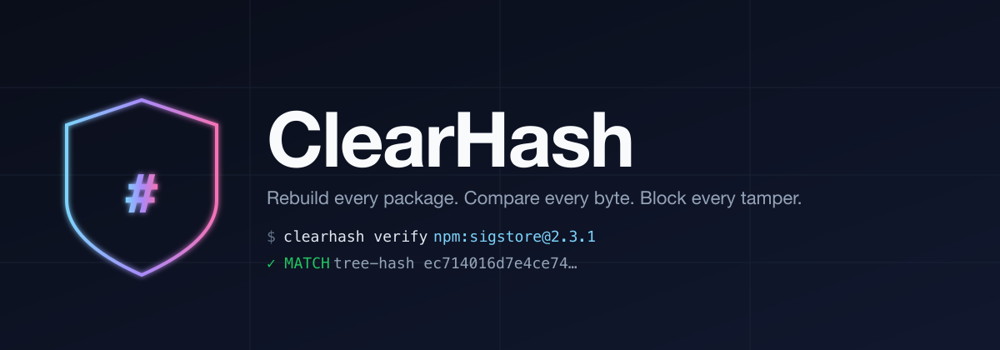
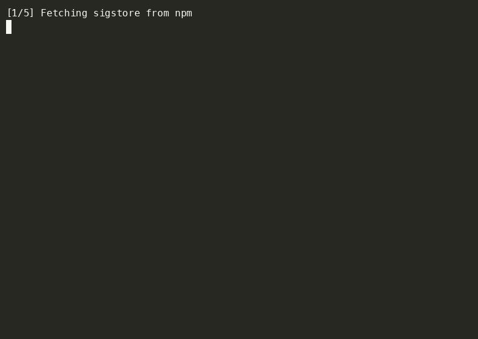
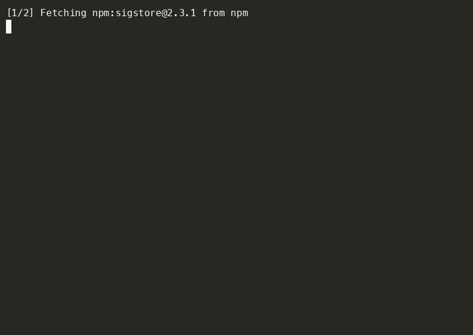
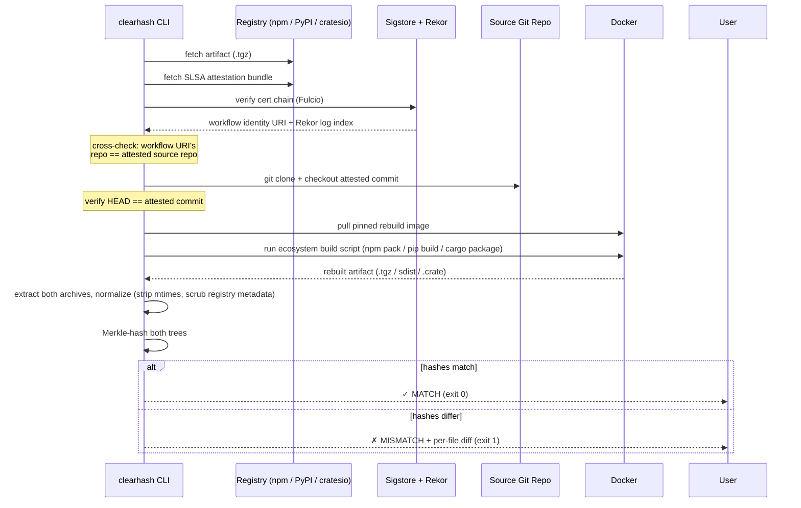

<picture>
  <source media="(prefers-color-scheme: dark)"  srcset="assets/banner-dark.png">
  <source media="(prefers-color-scheme: light)" srcset="assets/banner-light.png">
  
</picture>

[](.github/workflows/ci.yml)
[](https://www.rust-lang.org/)
[](#license)
[](#ecosystem-support)
[](https://www.sigstore.dev/)
[](https://clear-hash.vercel.app/)

> A pre-install gatekeeper that fetches a package, verifies its SLSA attestation through
> Sigstore + Rekor, rebuilds it from the attested source commit in an isolated Docker
> container, and compares the rebuilt file tree against the registry artifact. If anything
> differs, the install is blocked.

ClearHash answers a question almost nothing in the existing supply chain answers:
**"is the binary I'm about to install actually a build of the source code it claims to be?"**

---

## What it catches

The supply-chain attacks of the last five years (event-stream, ua-parser-js, the
post-install crypto-wallet stealers, xz-utils) all share one shape: the registry tarball
diverges from the source repo. Existing tools verify *who* signed the tarball (Cosign), or
*that the tarball matches itself across mirrors* (Sigstore transparency), but not *whether
the tarball is what the source code would produce*.

ClearHash actually does the rebuild and the comparison.

```
$ clearhash verify npm:sigstore@2.3.1
[1/5] Fetching sigstore from npm
      sha256: 1b5041a35f86125db7f872742502470753fd2e1109521b7dbff8a61d229a03c2
[2/5] Verifying Sigstore attestation
      commit: 46e7056ff991  (workflow: https://github.com/sigstore/sigstore-js/.github/workflows/release.yml@refs/heads/main)
[3/5] Spinning up rebuild container (node:20.11.1-bookworm-slim)
[4/5] Rebuilding from source at commit 46e7056ff991
      built: /tmp/clearhash-rebuild-CuR0xW/rebuilt/out/sigstore-2.3.1.tgz
[5/5] Comparing file trees

✓ MATCH npm:sigstore@2.3.1 tree-hash ec714016d7e4ce742f9aa23b6f16f19cb967bf82b78c343297013dcc268b107e
```

A tampered artifact gets a different ending:

```
✗ MISMATCH npm:sigstore@2.3.1 — 3 difference(s)
    ContentDiffers { path: "dist/index.js" }
    OnlyInRegistry { path: "dist/.evil-payload.js" }
    ModeDiffers { path: "bin/setup" }
```

### Live demos

<details>
<summary><strong>clearhash verify npm:sigstore@2.3.1</strong> — full pipeline (~36s, 4× playback)</summary>



</details>

<details>
<summary><strong>clearhash inspect npm:sigstore@2.3.1</strong> — attestation summary, no rebuild</summary>



</details>

---

## How it works



The comparison model is **file-tree content hash**, not byte-identical tarball SHA-256.
Strict byte equality isn't achievable today even with `SOURCE_DATE_EPOCH` — npm tarball
ordering, gzip compression levels, and registry-injected `package.json` metadata vary
between `npm pack` invocations. ClearHash normalizes both sides (strips mtimes, normalizes
modes, drops the four npm-injected fields `_id`, `_integrity`, `_resolved`, `dist`) and
compares a Merkle root over the resulting file tree.

---

## Try it without installing

A hosted instance of the **inspect** endpoint runs at
[**clear-hash.vercel.app**](https://clear-hash.vercel.app). It does the fetch + Sigstore parse +
cert-chain validation parts of the pipeline. The full **verify** flow stays in the CLI
because it needs a Docker daemon.

```bash
curl 'https://clear-hash.vercel.app/api/inspect?package=npm:sigstore@2.3.1'
```

Or paste a package into the form at [`/inspect`](https://clear-hash.vercel.app/inspect).

## Install the CLI

Requires Rust 1.88+ and a running Docker daemon (Docker Desktop or OrbStack on macOS).

```bash
git clone https://github.com/Builder106/ClearHash.git
cd ClearHash
cargo install --path crates/clearhash-cli
clearhash --version
```

---

## Use

```bash
# Full pipeline: fetch + attest + rebuild + compare
clearhash verify npm:sigstore@2.3.1

# Just fetch + parse the attestation envelope (no docker required)
clearhash inspect npm:sigstore@2.3.1

# JSON output for CI
clearhash verify npm:sigstore@2.3.1 --json

# Cargo has no SLSA attestation in the wild yet — opt in explicitly
clearhash verify --allow-unattested cargo:serde@1.0.197

# Keep the workdir to inspect a mismatch
clearhash verify npm:foo@1.0.0 --keep-workdir
```

### Exit codes

| Code | Meaning |
|------|---------|
| 0    | Tree-hash match. Safe to install. |
| 1    | Tree-hash mismatch *or* attestation signature invalid. Block. |
| 2    | No SLSA attestation, and `--allow-unattested` was not passed. |
| 3    | Infrastructure failure (no docker, no network, etc.). |

---

## Ecosystem support

| Ecosystem | Status | Attestation source | Rebuild image |
|---|---|---|---|
| **npm**   | ✅ end-to-end | `registry.npmjs.org/-/npm/v1/attestations/...` | `node:20.11.1-bookworm-slim` |
| **PyPI**  | 🚧 adapter scaffold | PEP 740 `/integrity/.../provenance` | `python:3.12.2-slim-bookworm` |
| **Cargo** | 🚧 adapter scaffold | _none — `--allow-unattested` required_ | `rust:1.78-slim-bookworm` |

The npm path is end-to-end working today. PyPI and Cargo land their full rebuild flows
behind the same `EcosystemAdapter` trait — no engine changes needed.

---

## What v1 verifies (and what's deferred to v1.1)

**v1 (today):**

- Envelope structural integrity (SLSA v0.2 *and* v1 in-toto statements)
- X.509 leaf certificate extraction from the Sigstore bundle
- Issuer = Fulcio (rejects bundles with non-Fulcio leaf certs)
- Subject Alternative Name → GitHub Actions workflow URI
- **Cross-check**: workflow URI's `owner/repo` segment matches the attested source repo
- Rekor transparency-log entry presence
- Source repo `git clone` + commit pinning with `HEAD == attested-commit` verification
- Network-isolated rebuild container (default bridge; build needs network for `npm ci`)
- File-tree Merkle compare with per-file diff output

**v1.1 (next):**

- Full Cosign DSSE signature verification using the leaf cert's public key
- Full Rekor Merkle inclusion-proof verification
- Air-gapped rebuilds via pre-fetched offline dep caches
- Wheel verification for PyPI (currently only sdists)

---

## Architecture

```
ClearHash/
├── crates/
│   ├── clearhash-cli/             # CLI binary; clap, console, tokio
│   ├── clearhash-web/             # bin + lib; shared Axum router (clearhash_web::app)
│   ├── clearhash-core/            # shared types: PackageRef, ProvenanceClaim, FileTreeHash
│   ├── clearhash-registry/        # reqwest fetchers
│   ├── clearhash-provenance/      # Sigstore + Rekor + envelope parsing
│   ├── clearhash-sandbox/         # bollard Docker orchestration + tree compare
│   └── clearhash-ecosystems/      # EcosystemAdapter trait + npm/pypi/cargo impls
├── api/
│   └── clearhash.rs               # Vercel function; wraps clearhash_web::app with VercelLayer
├── Cargo.toml                     # workspace root *and* a [package] that builds api/clearhash.rs
├── vercel.json                    # Vercel rewrites + runtime config
├── Dockerfile                     # alternative: multi-stage build of clearhash-web binary
└── fly.toml                       # Fly.io deployment config (Docker-based)
```

Every ecosystem-specific quirk lives behind `EcosystemAdapter`. Engine crates depend only
on the trait — adding a new ecosystem is one new file under `clearhash-ecosystems/src/`.

## Deploy your own

The web frontend can deploy two ways. The primary target is **Vercel** — the entire Axum
router runs as a single Rust serverless function via the
[official Vercel Rust runtime](https://vercel.com/docs/functions/runtimes/rust). The
secondary target is any Dockerfile-friendly host (Fly.io, Render, Railway, plain VPS).

### Vercel (recommended)

```bash
# One-time: link this repo to a new Vercel project
vercel link
# Deploy
vercel deploy --prod
```

Vercel auto-detects [vercel.json](vercel.json) and the root `[package]` + `[[bin]]` entries
in [Cargo.toml](Cargo.toml). The function binary is built from [api/clearhash.rs](api/clearhash.rs),
which wraps the shared `clearhash_web::app` router with `vercel_runtime::axum::VercelLayer`
so every route runs through the same handler that powers the local server.

### Docker (Fly.io / Render / Railway)

```bash
# Fly.io (one-time)
flyctl launch --copy-config --no-deploy
flyctl deploy

# Or build + run locally
docker build -t clearhash-web .
docker run --rm -p 8080:8080 clearhash-web
open http://localhost:8080
```

The deployed Docker image is ~158 MB (debian:bookworm-slim + the ~5 MB Rust binary + assets).
No registry credentials, no DB, no secrets — it just proxies the live npm/PyPI APIs.

---

## Caveats and threat model

ClearHash narrows the attack surface from "the registry served you whatever it wanted" to
"the registry served you the artifact that the attested source code produces, built by
the workflow that signed the attestation." Caveats:

1. **The lockfile is part of the trust root.** If `package-lock.json` itself has been
   tampered with at HEAD of the attested commit, the rebuild will faithfully reproduce
   the tampered tree. This is correct: the attestation says "this is what the source
   produces" — the rebuild verifies that claim, not "the source is benign."
2. **The rebuild container has network access** for dependency installs (`npm ci`,
   `pip install`, `cargo download`). `--ignore-scripts` blocks the highest-impact
   exfiltration path (lifecycle hooks). Fully air-gapped builds are v1.1.
3. **Determinism failures look identical to tampering.** If `npm pack` is genuinely
   non-deterministic for a given package (e.g. embeds a hostname), ClearHash flags it
   as a mismatch. The `--keep-workdir` flag is for triaging these cases.
4. **Docker is required.** No daemon, no verification. macOS users: Docker Desktop or
   OrbStack.

---

## Contributing

See [CONTRIBUTING.md](CONTRIBUTING.md).

---

## License

[MIT](LICENSE).
